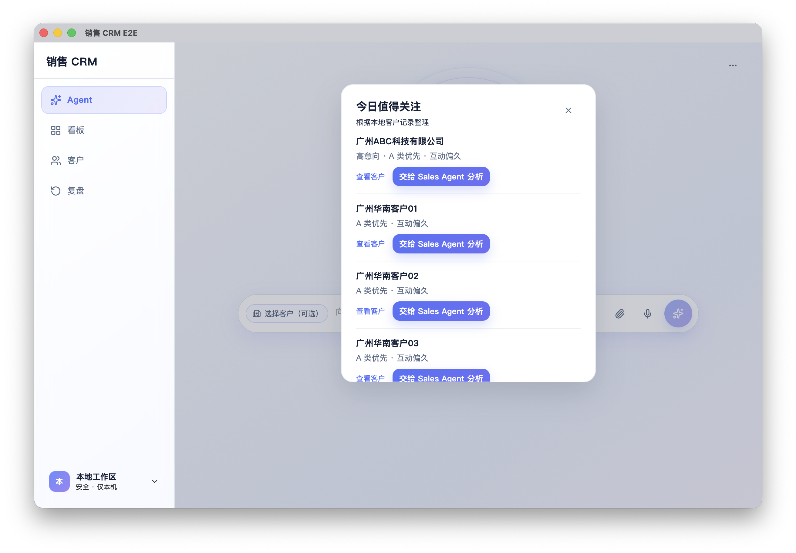

# AI Native CRM

[](https://github.com/renjianxin929-ux/ai-native-crm/releases)
[](https://github.com/renjianxin929-ux/ai-native-crm/actions/workflows/lint.yml)
[](LICENSE)

**An experimental Agent-First CRM where you work by intent, not by clicking through CRM screens.**

> Most CRMs make humans operate software.
> AI Native CRM explores the opposite:
> let the Agent operate the CRM, while humans stay in control.

> 传统 CRM 让人操作系统。
> AI Native CRM 想反过来：
> 让 Agent 成为主要操作入口，人负责判断、确认与关系。

**Agent-First CRM · Local-First · Human-Controlled · Built for AI-native sales workflows**

AI Native CRM is for maintainers, builders, and sales teams exploring a safer interaction model for AI-operated business software: the Agent can reason and propose actions, but domain capabilities, validation, and human confirmation remain explicit boundaries.



_The Tauri desktop client’s Agent daily-focus workflow, captured from an isolated E2E workspace with seeded demo records (no real customer data)._

## Why this project exists

Traditional CRM workflow:

```
Human → find a page → click fields → fill data → hunt history → guess the next step
```

AI Native CRM explores:

```
Human Intent
      ↓
Sales Agent
      ↓
CRM Capabilities
      ↓
Evidence / Reasoning
      ↓
Human Confirmation
      ↓
CRM Action
```

**The Agent is not a chatbot bolted onto the CRM. It is becoming the primary control surface of the CRM.**

## What V0.2.1 can do

V0.2.1 is a local-first desktop CRM with a real Agent operating surface. The following exists in the product today:

- Customer management, search, and entity resolution (including candidate disambiguation)
- Agent-driven customer analysis, interaction review, and next-action preparation
- Follow-up, visit, and task workflows
- Battle Card and evidence-aware reasoning
- Opportunity amount updates
- Customer creation
- Customer deletion with strong confirmation
- Human-confirmed CRM writes
- Natural-language CRM interaction on the Agent surface
- zh-CN / en-US on core Agent / Board / Customer / Review surfaces
- Local SQLite as CRM truth
- Local-first desktop experience (Tauri)
- Provider configuration with OS-level credential protection

This is still experimental. Natural-language coverage is not complete, and not every sentence becomes a CRM action.

## Agent-First Interaction

Examples the current surface can take:

- “分析一下这个客户”
- “我之前跟这客户见过几次？”
- “接下来该怎么跟？”
- “那就周三再找他”
- “新增一个广州星河科技客户，联系人张总”
- “把商机金额改到 22 万”
- “这个客户不用了，删掉”

How writes work:

- **Read-only reasoning** can answer directly from CRM evidence.
- **CRM mutation** goes proposal / clarification → human confirmation → write.
- **High-risk mutation** (especially delete) requires strong confirmation.

The Agent does not get a free pass to the database. Ambiguous or incomplete intent should ask, not guess.

## Architecture

```
Human Intent
      ↓
Sales Agent Control Surface
      ↓
Intent / Semantic Routing
      ↓
Capability Registry
      ↓
Reasoning / Read / Write Planning
      ↓
Authority + Validation + Confirmation
      ↓
CRM Domain
      ↓
SQLite / Tauri Host
```

Agent ≠ database access free-for-all.

Agent writes go through capability and confirmation boundaries.

Product code lives in `local-crm-desktop/`.

## Safety by design

- Human-confirmed writes
- Strong confirmation for destructive operations
- Capability authority boundary
- Input validation before CRM mutation
- Fail-closed cross-customer continuation
- Local-first CRM truth
- No bundled API keys

## Local-first

CRM business data is stored locally in SQLite.

- Windows: `%APPDATA%/com.localcrm.desktop/`
- macOS: `~/Library/Application Support/com.localcrm.desktop/`

Model requests need network connectivity when using a remote model provider.

Provider credentials use native OS protection:

- Windows: DPAPI (current-user)
- macOS: Keychain (AES-256-GCM master key)

You configure your own provider key. Keys are not shipped with the app.

## Chinese + English

Core product surfaces support **zh-CN** and **en-US** (Agent, Board, Customer, Review, and related chrome).

Some secondary / deep configuration surfaces are still being internationalized.

## Getting Started

### Prerequisites

- Node.js 22 or newer
- Rust 1.77.2 or newer
- The [Tauri 2 system prerequisites](https://v2.tauri.app/start/prerequisites/) for your operating system

Product code is in `local-crm-desktop/`:

```bash
cd local-crm-desktop
npm ci
npm run lint      # ESLint quality gate
npm test          # Vitest suite
npm run dev       # Vite frontend (use with Tauri for the desktop client)
npm run build     # Typecheck + frontend production build
npx tauri build   # Desktop installer for the current platform
```

Desktop development:

```bash
cd local-crm-desktop
npx tauri dev
```

## Verified Quality Gate

The v0.2.1 release was verified with:

- ESLint: 0 errors, 0 warnings
- Vitest: 241 files passed, 1 skipped; 3,433 tests passed, 16 skipped
- Rust: 55 tests passed
- TypeScript and Vite production build: passed

CI runs lint, frontend tests/build, and Rust tests for pushes and pull requests that affect the desktop app.

## Contributing and Security

Issues and focused pull requests are welcome. See [CONTRIBUTING.md](CONTRIBUTING.md) for setup, quality gates, and the project’s human-confirmed write boundaries.

Please report vulnerabilities through GitHub’s private vulnerability reporting flow described in [SECURITY.md](SECURITY.md), rather than opening a public issue.

## Current Status

### V0.2.1 — Agent Control Surface quality release

V0.2 introduced the first real Agent operating surface. V0.2.1 makes that baseline easier to evaluate and maintain by restoring the full quality gate, clearing lint debt, and documenting contribution and security workflows.

This is still an experimental open-source project.

Natural-language coverage is not complete.

The architecture and product semantics will continue to evolve.

## Roadmap

### V0.3

- simplify architecture
- improve natural-language semantic coverage
- reduce deterministic routing complexity
- strengthen Agent-first workflows
- continue internationalization
- improve developer ergonomics

V0.3 is a direction, not a promise to rewrite the project.

## Engineering philosophy

**Contracts before code.**

1. Product semantics
2. Architecture contract
3. Golden journeys
4. Fail-first tests
5. Minimal implementation
6. Foreground acceptance

> We try to decide what the system means before deciding how the code should look.

## What this project is NOT

- Not a generic chatbot
- Not an autonomous sales bot
- Not a cloud CRM clone
- Not a framework pretending to be a finished SaaS
- Not a claim of zero-error AI or complete natural-language coverage

## License

License: MIT

See [LICENSE](LICENSE) for the full text.

## Maintainer Notes

- [v0.2.1 release notes](RELEASE_NOTES_v0.2.1.md)
- [OpenAI Codex for Open Source application draft](OPENAI_OSS_APPLICATION.md)
